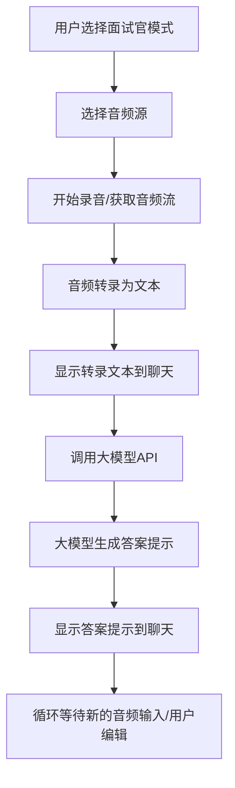

# 面试官功能开发计划

## 需求概述

在现有项目基础上，新增一个“面试官”功能。该功能将在左侧边栏新增一个选项。用户可以在设置界面配置音频输入源（支持网页或桌面应用），应用将从选定的音频源获取音频，转录为文字后显示在聊天记录中，并调用大模型API生成答案提示，为面试者提供答案提示。

## 开发计划步骤

- [x] 1.  **修改侧边栏导航 (`src/renderer/src/components/app/Sidebar.tsx`)**:
    *   在 `MainMenus` 组件中，找到 `sidebarIcons.visible` 数组，添加一个新的标识符 `'interviewer'`。
    *   在 `iconMap` 对象中，为 `'interviewer'` 添加一个合适的 Lucide React 图标，例如 `<Mic size={18} className="icon" />`。
    *   在 `pathMap` 对象中，为 `'interviewer'` 添加对应的路由路径 `'/interviewer'`。
    *   在 `src/renderer/src/i18n/locales/zh-cn.json` 文件中，为 `'interviewer.title'` 添加翻译文本“面试官”。

- [x] 2.  **添加面试官页面路由 (`src/renderer/src/App.tsx`)**:
    *   在 `src/renderer/src/App.tsx` 文件中，导入即将创建的 `InterviewerPage` 组件。
    *   在 `<Routes>` 组件内部，添加一个新的 `<Route>`，设置 `path="/interviewer"` 并将 `element` 设置为 `<InterviewerPage />`。

- [ ] 3.  **创建面试官页面组件 (`src/renderer/src/pages/interviewer/InterviewerPage.tsx`)**:
    *   创建新的目录 `src/renderer/src/pages/interviewer`。
    *   在该目录下创建 `InterviewerPage.tsx` 文件。
    *   这个组件将包含面试官页面的布局和逻辑，其界面将与“助手”界面非常相似。它需要：
        *   控制音频持续监听/暂停的按钮。
        *   显示音频转录文本的区域。
        *   显示与大模型交互的聊天界面，包括用户（转录文本）和助手（答案提示）的消息。
        *   与助手界面不同的是，面试官界面的用户消息将主要来自于音频转录，而非用户手动输入。
        *   可能需要一个输入框用于手动输入问题或编辑转录文本。

- [ ] 4.  **在设置界面添加音频源配置**:
    *   在 `src/renderer/src/pages/settings/SettingsPage.tsx` 中添加新的菜单项和路由。
    *   创建新的组件 `AudioSourceSettings.tsx` 来实现音频源选择和配置界面。
    *   实现获取系统音频输入设备的逻辑。

- [ ] 5.  **实现音频处理和转录**:
    *   研究如何在 Electron 应用中获取音频流并进行处理（例如使用 Web Audio API）。
    *   选择一个合适的语音转文本 (STT) 库或服务，并进行集成。
    *   创建或修改现有的 Service 文件（例如 `ApiService.ts` 或新建一个 `AudioService.ts`）来封装音频处理和转录的逻辑。

- [ ] 6.  **复用大模型交互和聊天显示逻辑**:
    *   分析 `src/renderer/src/pages/home/Chat.tsx` 组件的代码。
    *   提取与发送消息到大模型、接收和处理大模型响应、以及在界面上显示消息的逻辑。
    *   在 `InterviewerPage.tsx` 中复用这些逻辑，或者创建一个可复用的聊天组件。
    *   可能需要调整消息的格式，以区分用户（转录文本）和助手（答案提示）。

- [ ] 7.  **状态管理**:
    *   考虑是否需要在 Redux store 中为面试官功能添加新的 slice 或修改现有的 slice（例如 `messages.ts`）来管理面试官模式下的聊天记录、音频状态等。

## 流程图

